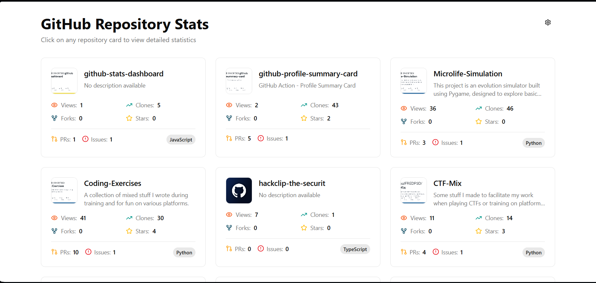
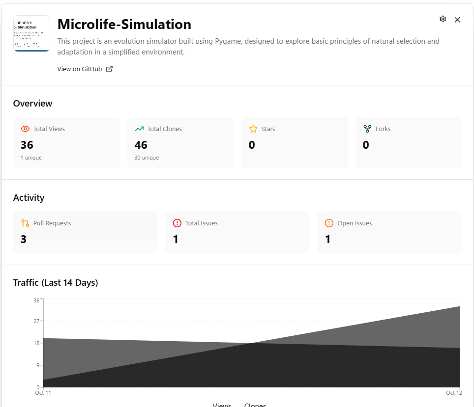
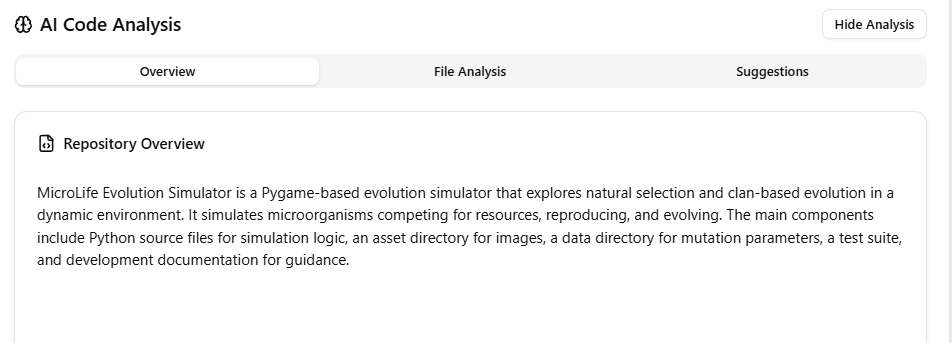
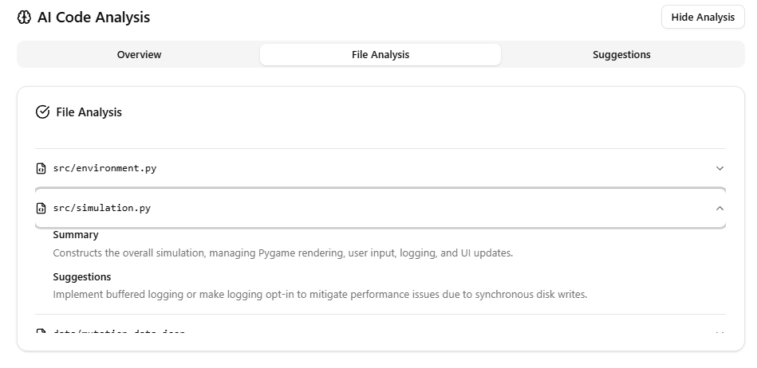
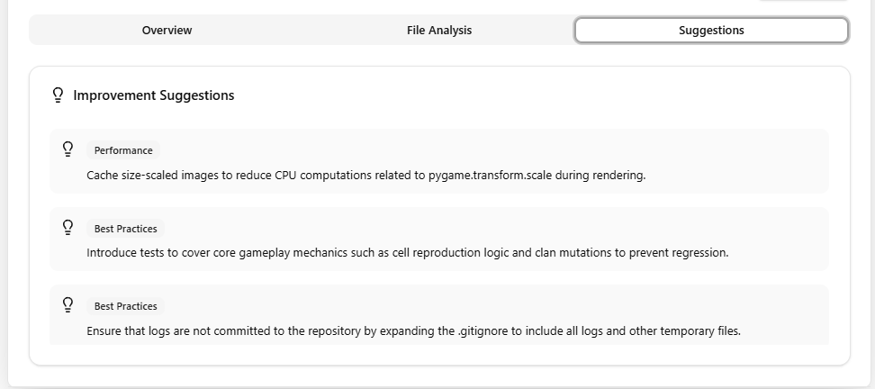
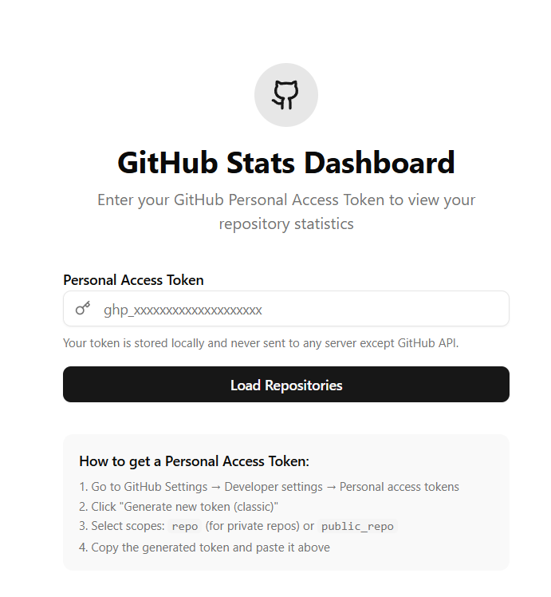

# GitHub Stats Dashboard

[](https://opensource.org/licenses/MIT)
[](https://vitejs.dev/)
[](https://reactjs.org/)
[](https://tailwindcss.com/)
[](https://app.netlify.com/projects/gitmystats/deploys)

A modern, interactive dashboard for visualizing GitHub repository statistics with a beautiful UI built using React, Vite, and Radix UI components. Track traffic, clones, forks, pull requests, and issues across all your repositories in one place.

## Features

### 🏠 Repository Overview Cards

  

- **Grid Layout**: Clean, responsive card-based layout displaying all your repositories
- **Key Metrics**: Each card shows:
  - Total views and unique views
  - Clone counts (total and unique)
  - Fork count
  - Star count
  - Pull request count
  - Issue count
  - Primary programming language
- **Repository Icons**: Uses GitHub's social preview images (OpenGraph images) as repository icons
- **Hover Effects**: Smooth animations and visual feedback on card hover

### 📊 Detailed Repository View

  

- **Smooth Animations**: Cards expand with fluid animations into full-screen detail views
- **Comprehensive Statistics**:
  - Traffic overview with total and unique metrics
  - Activity summary (PRs, issues, stars, forks)
  - Interactive charts showing traffic trends over the last 14 days
  - Repository metadata (language, creation date, last update)
- **Visual Data**: Area charts powered by Recharts showing views and clones over time
- **Easy Navigation**: Click anywhere outside or use the close button to return to the grid

### 🔐 Secure Authentication

- **Personal Access Token**: Uses GitHub PAT for secure API access
- **Local Storage**: Token is stored only in your browser, never sent to any server except GitHub
- **Privacy First**: All API calls go directly from your browser to GitHub

### 🤖 AI-Powered Code Analysis

- **Multi-Provider Support**: Support for multiple LLM providers (OpenRouter, Gemini, OpenAI)
- **Repository Architecture Understanding**: Analyzes overall project structure and design patterns
  


- **Per-File Code Summaries**: Provides detailed explanations of individual files and their purposes



- **Improvement Suggestions**: Offers actionable recommendations for code quality and optimization



- **Context Management**: Uses React Context API for LLM configuration and state management

#### LLM Integration Architecture

The AI analysis feature consists of several key components:

- **`LLMContext.jsx`**: React context providing LLM configuration and API keys across the application
- **`llmService.js`**: Unified service handling communication with different LLM providers
- **`useRepoAnalysis.js`**: Custom hook managing the analysis workflow and state
- **`RepoAnalysis.jsx`**: UI component displaying analysis results and suggestions
- **`LLMSettingsDialog.jsx`**: Configuration interface for selecting providers and managing API keys

#### Supported LLM Providers

| Provider | Model Support | API Key Required | Configuration |
|----------|---------------|------------------|---------------|
| **OpenRouter** | Various open-source models | Yes | API key from [openrouter.ai](https://openrouter.ai) |
| **Google Gemini** | Gemini Pro, Gemini Pro Vision | Yes | API key from [ai.google.dev](https://ai.google.dev) |
| **OpenAI** | GPT-3.5, GPT-4, GPT-4 Vision | Yes | API key from [platform.openai.com](https://platform.openai.com) |

#### Analysis Process

1. **Repository Scanning**: Fetches complete file tree and content using GitHub API
2. **Content Processing**: Extracts and prepares code for analysis
3. **LLM Query**: Sends structured prompts to the selected provider
4. **Response Parsing**: Processes JSON responses containing analysis data
5. **UI Presentation**: Displays results in an organized, readable format

## Getting Started

  

### Prerequisites

- A GitHub account
- A GitHub Personal Access Token with appropriate permissions

### 🔑 Creating a GitHub Personal Access Token

1. Go to [GitHub Settings → Developer settings → Personal access tokens → Tokens (classic)](https://github.com/settings/tokens)
2. Click **"Generate new token (classic)"**
3. Give your token a descriptive name (e.g., "Stats Dashboard")
4. Select the following scopes:
   - `repo` - Full control of private repositories (required for traffic data)
   - OR `public_repo` - Access to public repositories only
5. Click **"Generate token"**
6. **Copy the token immediately** - you won't be able to see it again!

### 🖥️ Using the Dashboard

1. Open the deployed dashboard URL
2. Paste your GitHub Personal Access Token into the input field
3. Click **"Load Repositories"**
4. Browse your repository cards
5. Click any card to view detailed statistics and charts

### Configuring LLM Analysis

To use the AI-powered code analysis feature:

1. Access the settings by clicking the settings icon in the dashboard header or within a repository detail view
2. Select your preferred LLM provider (OpenRouter, Gemini, or OpenAI)
3. Enter your API key for the selected provider:
   - [OpenRouter](https://openrouter.ai)
   - [Gemini](https://ai.google.dev)
   - [OpenAI](https://platform.openai.com)
4. Your API keys are stored locally in your browser's localStorage for convenience

## Technical Stack

- **Frontend Framework**: React 19
- **Styling**: Tailwind CSS with custom design system
- **UI Components**: shadcn/ui (Radix UI primitives)
- **Icons**: Lucide React
- **Charts**: Recharts
- **Animations**: Framer Motion
- **Build Tool**: Vite
- **Package Manager**: pnpm

## API Endpoints Used

The dashboard fetches data from the following GitHub REST API endpoints:

- **`GET /user/repos`** - List user repositories
  - Retrieves all repositories accessible to the authenticated user
  - Supports sorting by `updated`, `created`, `pushed`, `full_name`
  - Used to populate the main repository grid

- **`GET /repos/{owner}/{repo}`** - Repository details
  - Gets detailed information about a specific repository
  - Includes metadata like description, language, creation date, etc.

- **`GET /repos/{owner}/{repo}/traffic/views`** - View statistics (last 14 days)
  - Provides daily view counts (total and unique) for the past 2 weeks
  - Requires repository owner or collaborator access

- **`GET /repos/{owner}/{repo}/traffic/clones`** - Clone statistics (last 14 days)
  - Provides daily clone counts (total and unique) for the past 2 weeks
  - Requires repository owner or collaborator access

- **`GET /repos/{owner}/{repo}/pulls`** - Pull request data
  - Retrieves pull request information for statistics
  - Supports filtering by state (`open`, `closed`, `all`)

- **`GET /repos/{owner}/{repo}/issues`** - Issue data
  - Retrieves issue information for statistics
  - Supports filtering by state (`open`, `closed`, `all`)

- **`GET /repos/{owner}/{repo}/git/trees/{branch}?recursive=1`** - Repository file tree
  - Gets the complete file structure of a repository
  - Used for AI-powered code analysis features

- **`GET /repos/{owner}/{repo}/contents/{path}`** - File contents
  - Retrieves the contents of specific files
  - Used for AI-powered code analysis features

## Features Breakdown

### Repository Card Component

Each repository card displays:

- **Repository name and description** - Truncated for optimal display
- **Social preview image (OpenGraph)** - Fallback to default GitHub icon if not available
- **Views (total and unique)** - Traffic data from GitHub API
- **Clones (total and unique)** - Clone statistics with visual indicators
- **Forks count** - Number of repository forks
- **Stars count** - Repository star count with star icon
- **Pull requests count** - Open and total PR counts
- **Issues count** - Open and total issue counts
- **Primary programming language badge** - Color-coded language indicator

### Detail View Component

The expanded detail view includes:

- **Full repository header** with icon and description
- **External link** to view repository on GitHub
- **Overview section** with large metric cards showing key statistics
- **Activity section** showing recent PRs and issues
- **Interactive traffic chart** with 14-day trend data using Recharts
- **Repository information** including language, creation date, last update, and owner details

### Animation System

- **Smooth card-to-detail expansion** using Framer Motion's `layoutId` for seamless transitions
- **Hover animations** on cards with scale and shadow effects
- **Fade transitions** between grid and detail views
- **Micro-interactions** throughout the UI for enhanced user experience
- **Responsive animations** that work across different screen sizes

### State Management

- **GitHub API Hook** (`useGitHubAPI.js`) - Manages API calls, loading states, and error handling
- **Mobile Detection Hook** (`use-mobile.js`) - Responsive behavior management
- **LLM Context Provider** - Global state management for AI analysis configuration
- **Local Storage Integration** - Persists user preferences and API keys

## Development

### Development Workflow

#### Prerequisites

- **Node.js**: Version 18.0 or higher
- **pnpm**: Version 8.0 or higher (recommended package manager)
- **Git**: For version control

#### Getting Started

```bash
# Clone the repository
git clone https://github.com/TheRealFREDP3D/github-stats-dashboard
cd github-stats-dashboard

# Install dependencies
pnpm install

# Start development server
pnpm run dev

# The application will be available at http://localhost:5173
```

#### Available Scripts

- **`pnpm run dev`** - Start development server with hot reload
- **`pnpm run build`** - Build for production
- **`pnpm run preview`** - Preview production build locally
- **`pnpm run lint`** - Run ESLint code quality checks

### Troubleshooting

#### Common Issues

**Build Errors:**

```bash
# Clear pnpm cache and reinstall
pnpm store prune
pnpm install

# Clear Vite cache
rm -rf node_modules/.vite
```

**GitHub API Issues:**

- Verify your Personal Access Token has the correct scopes (`repo` or `public_repo`)
- Check that you haven't exceeded GitHub's rate limits (5,000 requests/hour)
- Ensure the token is valid and not expired

**LLM Integration Issues:**

- Verify API keys are correctly configured in the settings dialog
- Check that the selected provider supports the models you're trying to use
- Ensure API keys have sufficient permissions and credits

**Performance Issues:**

- Large repositories may take time to analyze due to file size limits
- Consider using more powerful LLM models for better analysis quality
- The dashboard fetches data on load; refresh the page to update statistics

#### Debugging

**Development Tools:**

- Browser DevTools for network requests and console errors
- React DevTools for component inspection
- GitHub API rate limit monitoring in browser Network tab

**Logging:**

- The application logs API errors to the browser console
- LLM analysis progress and errors are logged for debugging

### Project Structure

```
github-stats-dashboard/
├── src/
│   ├── components/
│   │   ├── ui/              # shadcn/ui components (46 components)
│   │   ├── Dashboard.jsx    # Main dashboard container
│   │   ├── RepoCard.jsx     # Repository card component
│   │   ├── RepoDetail.jsx   # Detailed view component
│   │   ├── LLMSettingsDialog.jsx # LLM provider configuration
│   │   └── RepoAnalysis.jsx # AI-powered code analysis component
│   ├── hooks/
│   │   ├── use-mobile.js    # Mobile detection hook
│   │   ├── useGitHubAPI.js  # GitHub API integration hook
│   │   └── useRepoAnalysis.js # LLM analysis hook
│   ├── services/
│   │   ├── githubContentService.js # GitHub content fetching service
│   │   └── llmService.js    # LLM integration service
│   ├── contexts/
│   │   └── LLMContext.jsx   # React context for LLM configuration
│   ├── lib/
│   │   └── utils.js         # Utility functions
│   ├── assets/              # Static assets
│   ├── App.jsx              # Main application component
│   ├── App.css              # Global styles and theme
│   └── main.jsx             # Application entry point
├── public/                  # Static assets
├── .gitignore              # Git ignore patterns
├── components.json         # shadcn/ui configuration
├── eslint.config.js        # ESLint configuration
├── index.html              # HTML template
├── jsconfig.json           # JavaScript project configuration
├── package.json            # Project dependencies and scripts
├── pnpm-lock.yaml          # pnpm lock file
├── vite.config.js          # Vite configuration
└── README.md               # This file
```

## Limitations

- **Traffic Data**: GitHub API only provides traffic data for the last 14 days
- **Rate Limiting**: GitHub API has rate limits (5,000 requests/hour for authenticated requests)
- **Repository Access**: You can only see statistics for repositories you have access to
- **Real-time Updates**: Data is fetched on load; refresh to see updated statistics

## Future Enhancements

Potential features for future versions:

- Historical data storage to track trends beyond 14 days
- Comparison view between multiple repositories
- Export functionality for statistics
- Dark/light theme toggle
- Filtering and sorting options
- Search functionality
- Organization repository support
- Webhook integration for real-time updates

## Security Notes

- Your GitHub token is stored only in your browser's memory during the session
- The token is never sent to any server except GitHub's official API
- Always use tokens with minimal required permissions
- Regularly rotate your tokens for security
- Never share your tokens or commit them to version control
- LLM API keys are stored in your browser's localStorage; consider rotating them regularly and avoid using keys with excessive permissions

## 📄 License

Distributed under the MIT License. See `LICENSE` for more information.

## 🙏 Acknowledgments

- [GitHub REST API](https://docs.github.com/en/rest)
- [Vite](https://vitejs.dev/) for the amazing development experience
- [Radix UI](https://www.radix-ui.com/) for accessible UI primitives
- [Tailwind CSS](https://tailwindcss.com/) for utility-first CSS
- [Lucide](https://lucide.dev/) for beautiful icons

This project is open source and available for personal and commercial use.

## Support

For issues, questions, or contributions, please refer to the project repository.

---

Built with ❤️ using React, Tailwind CSS, and GitHub API
