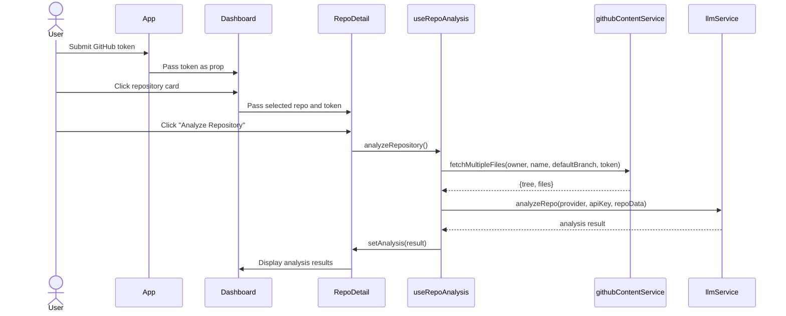
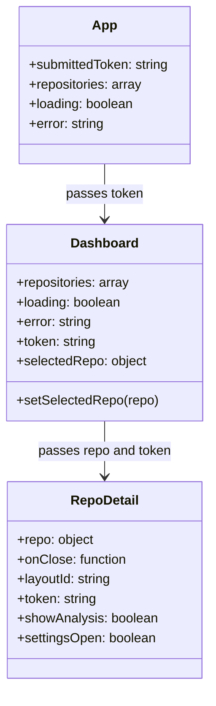
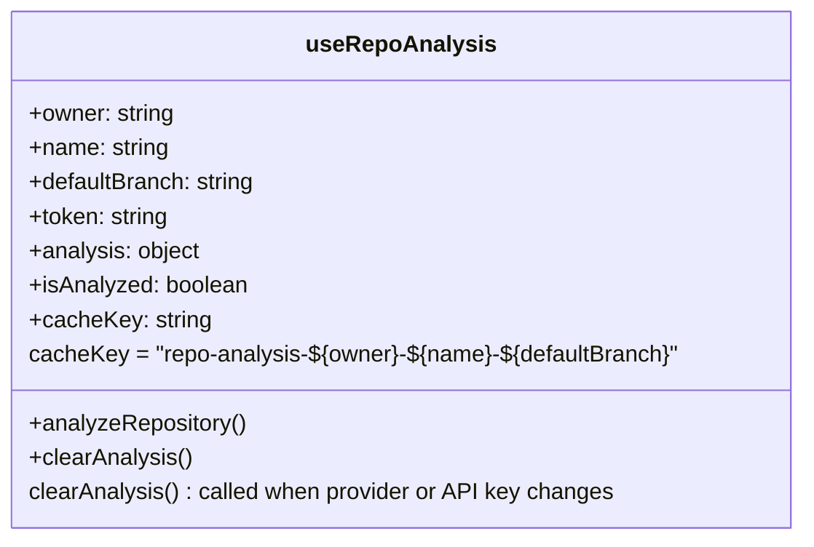

# Github Stats Dashboard - Diagrams

## Sequence diagram for repository analysis trigger and LLM processing



---

## Class Diagram



---

## Class diagram for useRepoAnalysis hook with updated cache key and reset logic



---

## Class diagram for repository object with defaultBranch attribute

```mermaid
    class Repository {
      +id: number
      +name: string
      +owner: object
      +description: string
      +html_url: string
      +language: string
      +stargazers_count: number
      +forks_count: number
      +open_issues_count: number
      +defaultBranch: string
      +viewsData: array
      +clonesData: array
      +socialImage: string
    }
```

---
